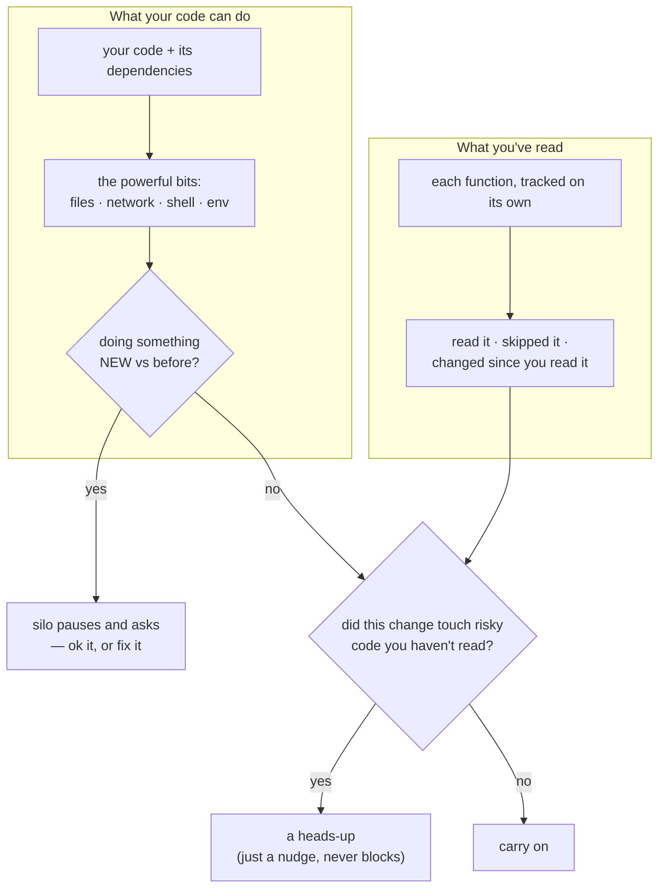
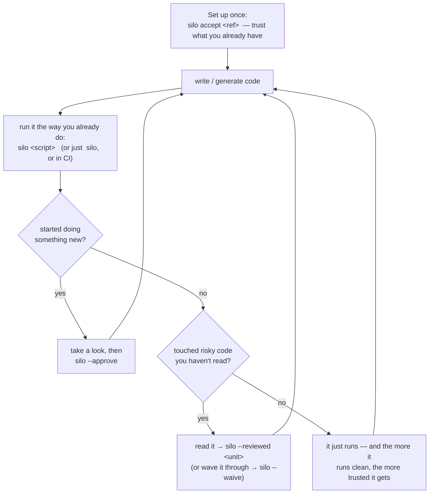
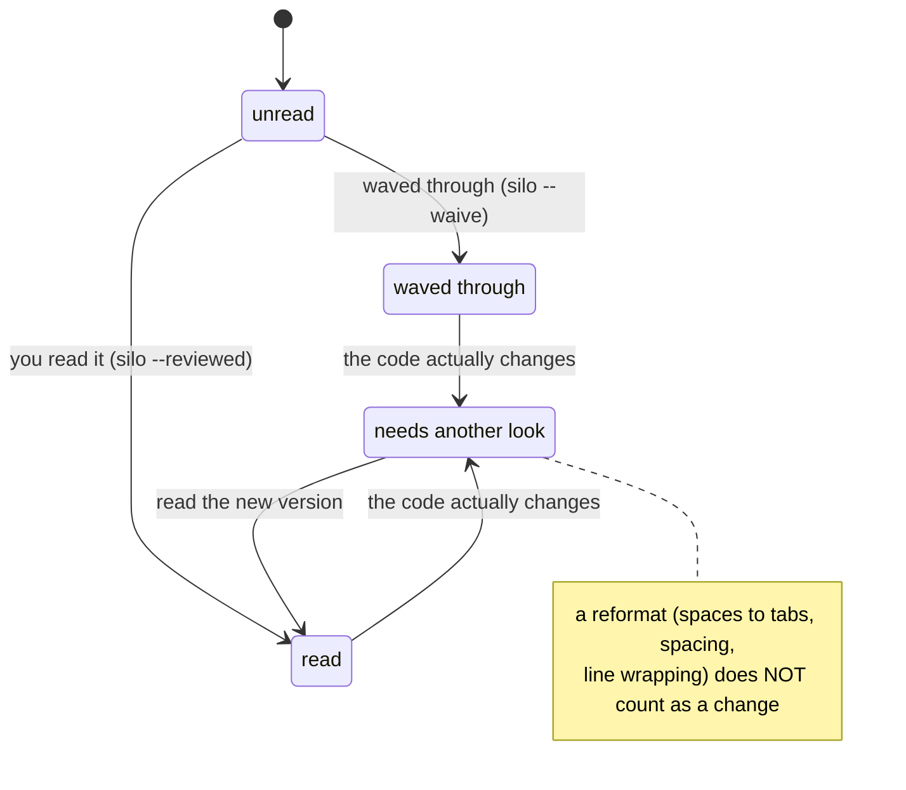
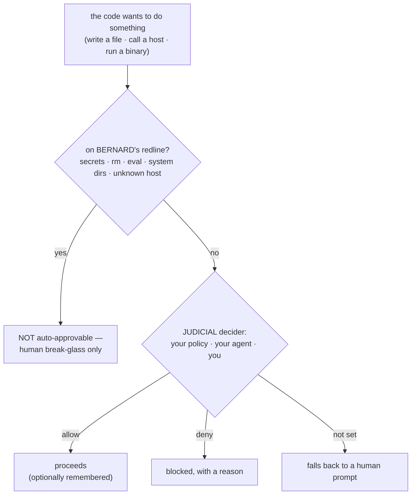

# silo

**Stay in control of code you didn't write.** AI generates code faster than you can read it — and it
quietly piles up next to the code you actually wrote and understand. Silo tracks, per function, what
you've read and what your code can reach (files, network, shell), and points you at the risky parts you
haven't looked at yet. Unproven code runs safely and earns trust over time, instead of just blending in.

> Status: **prototype.** Extracted from the `ok-claude` repo, where it was dogfooded on that
> project's `scripts/refresh.ts`. This is the design doc + working prototype.

It works at **two boundaries** — the **code you run** and the **dependencies you import** — and folds
both into one command. Run a script with `silo <script>` and it checks the new code first (pausing only
if it reaches for something genuinely new, nudging you toward risky bits you haven't read), then runs it.
`silo` on its own, or `CI=true silo` in CI, does the same check as a gate. Same idea throughout: code
earns trust by being read and by running clean, and you hear about it the moment that changes.

## Why

AI-generated scripts accrete into a codebase indistinguishable from vetted code. The usual fix —
mark them "unproven" — is a *claim* you have to remember to peel off. Silo makes trust:

- **earned** — a confidence score that *rises* with successful runs and *decays* when the code changes;
- **bounded** — a script can only touch capabilities you've approved; anything new stops and asks
  (Deno-style "stop before doing the thing").

So "let an unproven script run and earn trust" becomes safe: the cost of running it is bounded by the
grant, and its proven-ness is a number, not a vibe.

## Setup

```sh
npm install
```

Installs the dev dependencies: **tsgo** (`@typescript/native-preview`, the static engine's LSP),
**esbuild** (the boxer), **rolldown/vite** (DCE engines), **oxc-parser** (the consumer-surface AST),
**webcrack** + **wakaru** (deobfuscating bundled dependencies), and **tsx** (to run the `.ts` tools
directly — no build step).

## Usage

```sh
# the one command — run a script. On the first run after a dependency change it reviews your capability
# surface first (blocks on an un-approved expansion), then boxes + executes under the broker.
npx tsx cli.ts <script> [args…]
npx tsx cli.ts status             # managed scripts: capabilities, approved scopes, confidence
npx tsx cli.ts install            # cooldown install (release-age floor); flags dep changes for review

# the audit, explicitly — own code + node_modules vs the committed .silo/baseline.json
npx tsx cli.ts                    # bare: the two-sided baseline + trust ratchet
npx tsx cli.ts audit [dir]        # own code only; exit 1 on un-approved drift
npx tsx cli.ts audit . --approve  # accept the current surface as the baseline
npx tsx cli.ts --reviewed <file>#<fn>   # sign off a unit (I read it) · --waive <unit> (accepted unread)
CI=true npx tsx cli.ts audit      # non-interactive gate (fails on drift; the GitHub Action's engine)

# the quality axis, standalone
npx tsx cli.ts review             # the review queue — capability-bearing, unread, biggest first
npx tsx cli.ts review --json      # scored units as JSON (the review-overlay client seam)
npx tsx cli.ts accept <ref>       # onboard: take the code at <ref> as your reviewed baseline, review forward
```

## How you actually use it

Here's the problem silo solves: AI writes code faster than you can read it, and you quietly lose track of what you've actually vetted versus what just piled up. Six months later you've got a codebase you *nominally* own but couldn't explain.

silo keeps that honest by watching two plain things — **what your code can do** (touch files, hit the network, run shell commands) and **what you've actually read** — and it tracks the second one *per function*, so you get credit for the parts you've been through instead of facing one intimidating wall.

You keep working exactly as you do now. silo only speaks up in two cases: your code starts doing something *new*, or you changed something risky you haven't read yet.



Only the *new-behavior* case ever stops you (your code suddenly shelling out, say). The reading side never blocks — it just points at the handful of risky things *this change* touched. "You made it a little worse," not "here's your 400-item backlog."

### The everyday loop



There's no separate "review time." silo rides the commands you already run and mostly stays out of the way.

### Which command, when

| when you're… | run this |
|---|---|
| **adopting silo on an existing repo** | `silo accept <ref>` — trust everything as of `<ref>`, then only worry about what changes after |
| **writing or generating code** | `silo <script>` — runs it, and checks the new code along the way |
| wondering what to look at | `silo review` — the list, most-worth-reading first |
| done reading a function | `silo --reviewed <file>#<fn>` |
| not going to read it right now | `silo --waive <file>#<fn>` |
| sure the new behavior is fine | `silo --approve` |
| installing packages | `npm install` — nothing extra to remember |
| running in CI | `CI=true silo` — checks only, never changes anything |

silo remembers two things between runs (both committed to your repo, so they travel with the project): which new behaviors you've okayed, and which functions you've read.

### What "read" means, and why it survives a reformat

Reading is tracked per function, and it *sticks* — until that function's code actually changes, at which point silo quietly asks you to look again. No "unproven" sticky note to remember to remove; it just works off the code itself.

Crucially, "changes" means the code *meaning* changed — not the formatting. Run Prettier, switch tabs to spaces, rewrap a line: silo doesn't care, because it compares the parsed structure, not the raw text. So a repo-wide reformat won't wipe out everything you've read.



## Pairing silo with a coding agent

This is where it gets interesting. When a coding agent (Claude Code, say) runs code it just wrote, every new thing that code does — write a file, call a host, shell out — is a decision someone has to make. Today that's either *you*, interrupted for every prompt, or a blanket "allow everything" — which is how an agent ends up `rm`-ing something it shouldn't.

silo splits that decision into two tiers, so an agent can run its own code without you babysitting it and without handing it the keys:



- **BERNARD — the redline.** A hard list of things *nothing* gets to auto-approve: reading secrets (`~/.ssh`, `.env`, keychains), writing to system dirs, running `rm`/`sh`/`curl`, `eval`, calls to an unknown host. These never reach the routine "allow?" path — they demand a human break-glass. So no decider, human *or* AI, can quietly approve reading your private keys. Extend it per project with `BERNARD=<patterns>`.
- **JUDICIAL — the decider.** Everything else routes to a decider *you* choose: `JUDICIAL=<command> silo <script>`. That command runs in your trusted shell (never inside the sandboxed code), gets each request as JSON on stdin — plus silo's own signals about the script (which one, how proven it is) — and answers `{ behavior: "allow" | "deny", scope?, persist? }`. Error or silence → denied.

That verdict shape is deliberately the **same as the Claude Agent SDK's `PermissionResult`**, so wiring an agent in as the decider is natural: the agent sees *"this script wants `fs:write:/tmp/out.json`, confidence 0.2"* and decides — inside a redline it physically cannot cross. [`examples/judge-policy.mjs`](examples/judge-policy.mjs) is a working decider (a plain policy: allow reads, writes only under `/tmp`, deny exec); swap the policy body for an LLM call and it's an AI judge, or chain `policy → AI → human` in one command.

It helps with the *reading* side too: `silo review --json` hands an agent the exact queue you'd see — each function, whether it's been read, whether it looks AI-authored, whether it's risky, and where it lives — so an agent can triage ("here are the five worth actually looking at") or work the list *with* you instead of leaving you to face it alone.

> **Built vs. designed:** the two-tier decider (BERNARD + JUDICIAL), the `JUDICIAL=<command>` seam, the signals passed to it, the fail-closed contract, and the `review --json` seam are all in the repo and working. The *agent* judge itself is a command you supply — the example shows the shape. A turnkey Claude judge and an AI-assisted review-and-fix loop are designed-for, not yet built.

## Two layers of capability analysis

- **Static — *what it can reach.*** Drive **tsgo's LSP call hierarchy**: root at every top-level
  function (including the non-exported entry `main`), walk `outgoingCalls` recursively, and classify
  each callee by its **definition file** (`fs.d.ts` → `fs:read`/`fs:write`, `child_process.d.ts` →
  `exec`, `lib.dom` `fetch` → `net`). Type-precise, complete-ish (all paths), and yields the call path.
  (An alternate engine uses vite tree-shaking / DCE for reachability — a safer over-approximating bias.)
- **Runtime — *what it actually reaches, and where.*** A broker injected into the bundle intercepts
  capability calls and gates the **resolved scope** (`net:localhost:3000`, `fs:write:/path`) against an
  allowlist, prompting on anything new. Precise scopes, but only for paths that run.

Static says what it *can* do; runtime refines to where it *did* — and a newly-observed scope outside
what's approved is the flag.

## Layout

The lone file at the repo root is **`cli.ts`** — the entrypoint (the `silo` bin), routing bare `silo`
(two-sided baseline) / `audit` / `status` / `install` / `<script>`. Everything else lives in folders:
`commands/` + `shared/` are the orchestration `cli.ts` wires together; `detect/`, `enforce/`, `policy/`,
`install/` are the subsystems. (The `.mjs` files are the ones spawned as subprocesses or injected into boxed
bundles, so they run under plain node/deno without tsx — that's why they can't be `.ts`.)

**`commands/`** — the flows `cli.ts` dispatches:

| file | role |
|---|---|
| `runner.ts` | the `silo <script>` runner: fingerprint → (audit escalation) → box → execute → score. |
| `audit.ts` | the **capability** axis — consumer + node_modules surface vs the committed baseline; drift + `capabilityDrift`. |
| `review.ts` | the **quality** axis — per-function review state + the trust ratchet. |

**`shared/`** — state + signals both axes use:

| file | role |
|---|---|
| `paths.ts` | `.silo/` layout + root resolution (and where the spawned engines resolve from). |
| `cache.ts` | the capability-fingerprint cache. |
| `provenance.ts` | AI-authorship heuristic (doc-comment coverage + markers) — a review signal used by both axes. |

**`detect/`** — *what code can do:*

| file | role |
|---|---|
| `capability-detectors.ts` | the shared detection core (the regex vocabulary) — what counts as `fs:read`/`exec`/`net`/… |
| `static-lsp.ts` | static reachability via tsgo LSP call hierarchy (`--json` for machine output). |
| `static-dce.ts` | alternate static reachability via tree-shaking (DCE). |
| `import-surface.ts` | member-level consumer surface — what your code imports & uses per dependency. |
| `package-capabilities.ts` | what a dependency's *used slice* can reach (DCE + deobfuscation). |
| `deobfuscate.ts` | un-thunk / un-minify bundled deps (webcrack ∪ wakaru) before detection. |

**`enforce/`** — *stop it at runtime:*

| file | role |
|---|---|
| `bundle.ts` | bundle a script with the broker injected + `node:fs`/`node:child_process` rewritten to brokered wrappers. |
| `capability-broker.mjs` | the injected runtime broker — gates `net`/`fs`/`exec` → JUDICIAL decider → BERNARD redline; allowlist + grants. |
| `decide.mjs` | the shared decision core (redline + JUDICIAL) — one brain for the in-process broker and the Deno backend. |
| `preload.mjs` · `guard.ts` | in-process alternative to `bundle.ts` (a `node --import` preload) + its pluggable handler. |
| `deno-broker.mjs` · `silo-deno.mjs` · `codegen-gate.mjs` | the Deno backend — permission broker + eval/codegen shim. |

**`policy/`** — the tunable rules: `capability-policy.ts` (which caps count as dangerous) · `import-policy.ts`
(import denylist). **`install/`** — `cooldown.mjs`, the release-age installer (the `preinstall` hook +
`silo install`). **`examples/`** (`ci-demo`, `judge-policy.mjs`) and **`test/`** (`node/` + `deno/`).

## The runner

```sh
silo <script> [args…]   # (maybe review the surface) → fingerprint + import policy → drift gate →
                        # box + execute under the broker → persist grants → score
silo status             # managed scripts: capabilities, approved scopes, confidence
```

**Per script.** Each run computes a fingerprint (content hash + imports + static caps), checks import
policy, gates on **drift** (a new capability/import is TOFU-prompted), **boxes** the script (broker +
builtin rewriting), executes it with the broker's allowlist seeded from the registry's **approved
scopes**, persists any new grants, appends to the run ledger, and updates confidence.

**The audit rides the run.** A dependency install (via the [cooldown](#dependencies--release-age-cooldown)
below) drops a `.silo/pending-review.json` breadcrumb when it moves your lockfile. The next `silo <script>`
sees it and carries the project capability check *before* executing — so the one command a dev learns
handles the whole model:

- **un-approved expansion → blocks.** A dep (or your own code) reaching a *new* capability vs the
  committed baseline stops the run and points you at `silo` / `silo --approve`; the script never executes.
- **touched-but-unread → nudges.** The **trust ratchet**: capability-bearing units your change touched that
  you haven't reviewed. Non-blocking — a reminder only; `silo --reviewed <file>#<fn>` clears it.
- **no baseline yet → onboards.** Establishes your first baseline from the current surface (announced —
  review + commit it), then runs. No separate setup step.
- **surface unchanged → clears the breadcrumb and runs.**

No breadcrumb → the run trusts the committed baseline and stays cheap (no audit). Under CI the breadcrumb is
ignored — there the gate (`CI=true silo audit`) *is* the drift check. Blocking only ever happens on a
capability **expansion**; the ratchet blocks solely at that gate moment, never on a run.

State (generated, git-ignored): a registry (`registry.json` — per-script fingerprint + approved scopes), a
run ledger (`runs.jsonl`, append-only), the boxed bundle per script, and the transient
`pending-review.json` breadcrumb.

## The dependency audit (`silo audit`)

Where the runner governs *scripts you write*, `audit` governs *dependencies you import* — the
consumer↔package boundary. It joins two axes, per dependency:

- **Surface — *what you use.*** `detect/import-surface.ts` does member-level binding analysis (oxc AST):
  which exports of each dependency your code actually imports and calls (`import * as _; _.get(…)` →
  member `get`; computed/dynamic access → `*`). Resolved to `pkg@version`.
- **Capability — *what that reaches.*** `detect/package-capabilities.ts` bundles the *used slice* with
  rolldown DCE and detects what it can do (`fs:read`/`fs:write`, `exec`, `net`, `eval`, `env`).
  Builtins map directly; a dependency that ships **bundled/minified** dist is deobfuscated first
  (`detect/deobfuscate.ts` — webcrack ∪ wakaru) so thunked code doesn't silently drop caps.

The join (`member → capability`) is diffed against the approved baseline (`.silo/baseline.json`). A new member —
or the strongest signal, a **new capability** (`fs:read` gaining `fs:write`) — is un-approved drift;
`audit` **exits non-zero** on drift (so it gates a commit/CI), and `--approve` accepts the current
surface. This is honest-drift at the *interface*: not "is this package safe?" (the package-intrinsic
supply-chain problem) but "is my relationship to this package still the one I approved?"

## Dependencies — release-age cooldown

A deliberate stance: **no lockfile.** Float to the newest code so breakage from an upgrade surfaces
immediately instead of being deferred — *but* never install a release during its risky first week, when
a freshly-published compromised version does the most damage. So pin nothing; keep every dependency at
`"latest"`, and let the cooldown pick newest-that's-been-out-≥7-days.

The trick is that a bare **`npm install` just does this**, via a `preinstall` hook that calls Silo:

```jsonc
// your project's package.json
"scripts": { "preinstall": "[ -n \"$SILO_COOLDOWN_GUARD\" ] || npx -y @brianjenkins94/silo install" },
"dependencies": { "some-pkg": "latest", … }
```

```sh
npm install                         # preinstall re-resolves with --before=<now − 7d>; exits 0
SILO_COOLDOWN_DAYS=14 npm install   # widen the window
```

npx fetches Silo into its own cache (independent of your not-yet-installed `node_modules`), so this works
on a clean clone. The `[ -n "$SILO_COOLDOWN_GUARD" ] ||` prefix skips the npx round-trip on the inner,
guarded re-install. (Silo's own repo cools its deps with `npm run deps` rather than a self-`preinstall` —
a published package must not carry an install-time script that fires in every consumer.)

How it works — and it took some proving (see git history): the hook ([install/cooldown.mjs](install/cooldown.mjs))
tries **pnpm first**, since pnpm supports this natively (`--config.minimumReleaseAge=<minutes>`, no
workaround needed) — if `pnpm` isn't on PATH or that install fails, it falls back to npm. npm has no native
equivalent, only `--before=<date>`, and npm fixes versions at *resolution* time from startup config, so a
lifecycle script can't change the parent's resolution. So the npm fallback **re-runs the install itself**
with `--before` (guarded against recursion via `SILO_COOLDOWN_GUARD`), having first removed `node_modules`
+ the hidden `node_modules/.package-lock.json` that npm writes pinning *newest*. The parent install then
honors the cooled lockfile the hook wrote and exits 0 — no wrapper, no abort. `npm`'s `--before` resolves
`"latest"` to the newest version published before the date; its two hard-fail cases get a clear message:

- a dependency whose only releases are younger than the cooldown → *too fresh, wait it out* (the policy
  working, not a bug);
- an exact pin newer than the cutoff → npm refuses it (another reason to stay on `"latest"`).

When the resolved lockfile actually changes, the hook also drops a `.silo/pending-review.json` breadcrumb —
only inside an existing `.silo/` (it never *creates* one, so a non-silo project isn't littered), and only
when the lock moved. That's the signal the [runner](#the-runner) keys off to review your moved surface
before the next `silo <script>` runs. The [capability gate](#ci--the-capability-gate-github-action) below is
the CI complement that catches anything that slipped in by other means.

## CI — the capability gate (GitHub Action)

The same drift gate runs in CI to **reject an un-approved expansion of capability** in a pull request.
There is no `--ci` flag: the gate **arms automatically when `CI` is set** (as it is on GitHub Actions and
most CI) — so `CI=true silo audit` (own code) or bare `CI=true silo` (two-sided) is the non-interactive
mode. It never writes or `--approve`s, fails if there is no committed `.silo/baseline.json` to gate
against, and exits non-zero on any drift — emitting a GitHub `::error` annotation inline on the PR.

A composite action ships at the repo root ([action.yml](action.yml)):

```yaml
# .github/workflows/silo.yml
- uses: actions/checkout@v4
- uses: brianjenkins94/silo@main
  with:
    mode: baseline          # own code + node_modules (supply-chain); 'audit' = own code only
    working-directory: .     # project root holding .silo/baseline.json
```

Commit `.silo/baseline.json` (it's the approved surface; `.silo/.gitignore` already excludes the runner's
`registry.json`/`runs.jsonl`). When a PR adds, say, `node:child_process`, the gate fails with
`node:child_process → exec  + new` and the contributor runs `silo audit --approve` to consciously accept
it. [examples/ci-demo](examples/ci-demo) is a self-contained, committed-baseline project the repo's own
workflow gates as a live demo.

## Confidence

A **Wilson lower bound** over weighted runs: real (`--apply`) runs weigh `1.0`, dry-runs `0.25`, and
runs at a now-stale content hash decay. So: 0 runs → `unproven`; clean real runs climb it; an edit
decays it; a capability/import expansion re-gates. A script with only dry-runs stays `unproven` no
matter how many — which is the point.

## Scoping & enforcement

- **Net** is gated at **domain** granularity, **fs** at **folder** granularity, **exec** at **binary** —
  the resolved scope is matched against an allowlist; a miss prompts and (on approval) persists.
- Scopes map directly onto **Deno permissions** (`--allow-net=host`, `--allow-write=folder`), so a Deno
  (or OS-sandbox) backend is the natural path to enforcement stronger than the in-process broker.
- A target that can't be pinned statically (an env-driven URL, a param path) is `*` — a first-class
  signal that the reach is indeterminate and needs a broad grant.

## Status — proven vs. open

**Proven (per-script):** static fingerprint (entry rooting, read/write granularity, call paths); import
policy; drift gate; the enforcing broker (net domain prompt, fs/exec folder/binary **sync** prompt on
the real resolved scope; allow / grant / deny); allowlist seeded from approved scopes; churn-decayed
confidence.

**Proven (per-dependency, `silo audit`):** member-level consumer surface (named/default/namespace +
member access, computed → `*`); slice-scoped capability via rolldown DCE; builtin→capability mapping;
deobfuscation of bundled dist (webcrack ∪ wakaru, validated to recover caps esbuild thunks otherwise
hide); surface→capability join + drift gate (exits non-zero).

**Proven (the fused runner + trust ratchet):** the audit riding `silo <script>` off the cooldown
breadcrumb — block on capability expansion, a non-blocking trust-ratchet nudge (diff-scoped:
capability-bearing units your change *touched* that you haven't reviewed or waived — "you made it worse",
not "you have debt"), first-run baseline onboarding, and the breadcrumb ignored under CI. The two per-unit
review gestures, hash-anchored: `--reviewed` (I read it) / `--waive` (accepted unread).

**Open / known gaps:**
- **`env` / property-read caps** — call hierarchy is call-based, so `process.env` (a property read) is
  invisible; needs a complementary LSP `references` pass.
- **Flag-on-unresolved** — tsgo *under-reports* when types don't resolve (no edge for an unresolved
  callee); a real impl must treat an unresolved call as "assume capability / flag" and run against a
  typed program (a `tsconfig` resolving `@types/node`).
- **First-run interactive grant** — the broker's sync prompt works against a TTY; in a non-interactive
  harness, stdin doesn't pass through the nested `spawnSync` (the grant-persistence path is wired and
  demonstrated by pre-seeding approved scopes).
- **Enforcement backend** — the broker is in-process; Deno or an OS sandbox would be a stronger box.
- **Surface shadowing** — `detect/import-surface.ts` matches binding names within a file, so a local
  variable shadowing an import name is mis-attributed (rare, and over-reports — the safe direction).
  v2 is scope-resolved references (tsgo LSP or oxc-semantic).

## Non-goals

- **Not an adversarial sandbox.** Silo does honest-drift detection + least-privilege, not defense against
  code *actively hiding* what it does (obfuscation, `globalThis[x]`, dynamic `eval`). The framing is
  "exercise suspicion on a package *changing its needs*," not "prevent targeted badness."
- **Not the package-intrinsic supply-chain problem** ("is this package safe?" — whole-code, transitive,
  adversarial; LavaMoat / SES / Compartments territory). Silo is per-*process* (≈ Deno); `silo audit`
  covers the **consumer-relationship** half ("is my usage of this dep still what I approved?"), not the
  intrinsic one.
- **Not a linter.** A linter codifies *style*; Silo codifies *capability + provenance* — a different layer.

## Design notes & rationale

- **Two static engines, on purpose.** `static-lsp` (tsgo LSP call hierarchy) is type-precise and yields
  the call *path*, but **under-reports** when types don't resolve (a dangerous bias) and is blind to property
  reads. `static-dce` (vite tree-shaking / DCE) **over-reports** (conservative-keep — the *safe* bias)
  and needs no types. Running both and surfacing disagreements is itself the blind-spot detector. (tsgo: its
  LSP ships a `callHierarchyProvider` today; ts-patch/ttsc is for build-time transforms, not standalone
  analysis.)
- **Static + runtime, merged.** Static = "what it *can* do" (gate-time, complete-ish); the runtime broker =
  "what it *did*, and where" (precise scopes, partial coverage). Neither alone suffices — a script's dry-run
  path exercises *no* capabilities, which is why static reachability is required at all.
- **Bundling as the injection point.** A userland retrofit (no engine/TC39 support) and the only place to
  wrap builtin *named imports* uniformly. Lesson from a reverted refactor: a shared-helper extraction earns
  its keep only with a *second* consumer — a single-consumer one was built and collapsed back inline.
- **AI-provenance = doc-comment coverage, not phrase-matching.** The audit annotates a capability expansion
  `⚠ likely-AI` when the introducing file scores likely — by the *fraction* of its functions carrying a
  (non-JSDoc) doc comment (AI documents nearly everything; humans selectively), plus explicit
  "Co-authored-by: Claude" / git markers. Reporting only — never changes pass/fail. (Lint-error density was
  considered and rejected: in-context AI code is *more* lint-clean, so the signal inverts.)

**On the dependency audit (`silo audit`):**

- **Raw source, not esm.sh, for analysis.** esm.sh's *transformed* output misleads both ways — minification
  collapses `fs:read`/`fs:write` (under-reports) and its DCE leaves dangling `node:` imports (over-reports),
  so analyze the raw npm tarball. **Sourcemaps are forgeable** (attacker-controlled JSON, no integrity link
  to the running `.js`) → cosmetic-only, never the verdict.
- **Deobfuscation = webcrack ∪ wakaru.** Much of npm ships pre-bundled `dist/`, so "the tarball is clean
  source" is often false. webcrack owns *obfuscation depth* (string-arrays, control-flow-flattening — the
  malware case); wakaru owns *bundler breadth* (SystemJS/AMD/UMD/Bun). They fail on orthogonal axes, so
  their recovered caps are **unioned** (validated: esbuild's own `exec`, hidden behind a `__toESM` thunk, is
  recovered only after deobfuscation).

## Hard-won gotchas

- **tsgo LSP:** launch `tsgo --lsp -stdio`. callHierarchy is **call-based** → misses property reads
  (`process.env`); attributes calls to the **enclosing function** → recurse into nested closures (a `fetch`
  under an inner arrow); **under-reports unresolved symbols** → needs a `tsconfig` resolving `@types/node` or
  caps silently vanish.
- **esbuild:** filters use **Go regex (RE2)** — no `u` flag. Virtual modules need `resolveDir` set in
  `onLoad` or imports won't resolve. `platform: "node"` auto-externalizes builtins; to *wrap* one,
  `onResolve` → custom namespace, `onLoad` → a module that gets the real builtin via
  `createRequire(import.meta.url)("node:fs")` (bypassing the rewrite) and re-exports wrapped fns.
- **macOS `/tmp` is a symlink to `/private/tmp`** → breaks entry guards like
  `` import.meta.url === `file://${process.argv[1]}` `` (resolved vs literal). Invoke with the realpath, or
  compare realpaths (the boxer writes its temp entry under `/private/tmp`).
- **Sync prompts:** `fs.readSync(0, …)` reads stdin synchronously (to gate sync builtins like
  `writeFileSync`), but **stdin does not pass through a nested `spawnSync` with `stdio:"inherit"`** in a
  non-interactive harness — so first-run grants can't be exercised in CI (they work interactively;
  persistence is wired).
- **vite DCE:** fix `process.env` rewriting with `define: { "process.env": "process.env" }` (identity).
